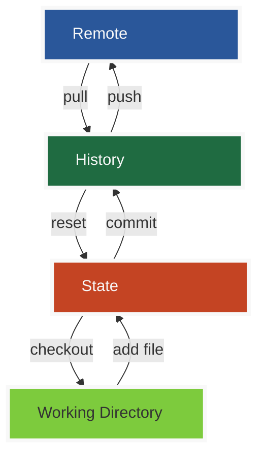

# **Git**

## 环境配置

### 下载

官网：https://git-scm.com/

镜像：https://npm.taobao.org/mirrors/

### 安装

1. 安装包打开后下一步按默认走到最后一步

### 基本命令

- CD		 切换目录
- pwd       显示当前目录
- clear      清屏
- touch     新建一个文件
- mkdir    新建目录
- rm -f      删除一个文件夹
- mv         移动文件
- ls            显示当前目录的文件列表
- exit        退出
- history   查看命令历史

#### GIT配置

```bash
#查看全局配置(用户名、邮箱,文件位置C:\Users\LLI50\.gitconfig)
git config --global -l 
```

	

```bash
#查看系统配置
git config --system --list 
#文件在git安装目录的/etc/gitconfig
```

	

```bash
#设置用户名
git config --global user.name "lli50"
#设置邮箱
git config --global user.email "devil.li.53@gmail.com"
```


## GIT原理


	




## 项目搭建	

## 文件操作

## 使用